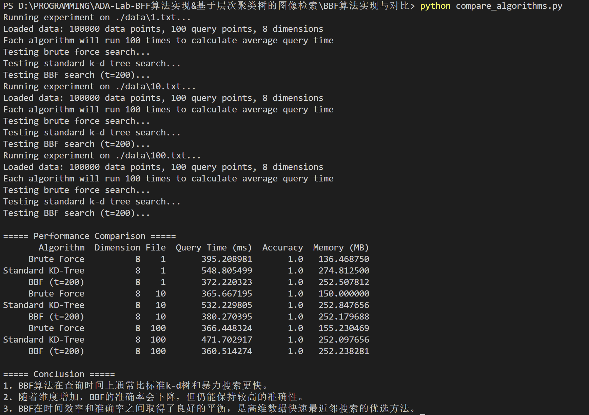
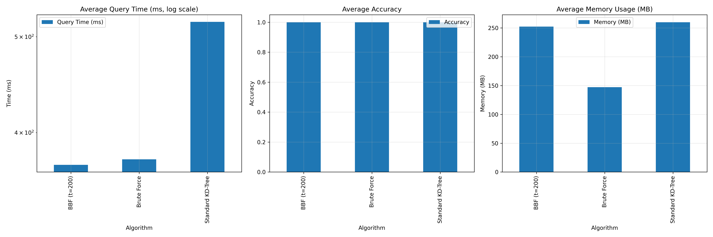

# BBF算法实现与对比实验报告

## 1. 算法实现概述

本实验实现了三种最近邻搜索算法，并进行了对比分析：

- 暴力搜索 (Brute-Force)
- 标准k-d树搜索 (Standard KD-Tree)
- BBF搜索 (Best Bin First)

### 1.1 k-d树实现

k-d树是一种专门用于多维空间搜索的树形数据结构。其核心思想是通过轮流选择不同的维度进行空间分割，将高维空间划分为多个子空间，从而加速最近邻搜索。

k-d树的构建过程如下：

1. 选择一个维度作为分割维度
2. 在选定维度上找到中位数，作为分割点
3. 将所有在该维度上小于中位数的点放入左子树
4. 将所有在该维度上大于中位数的点放入右子树
5. 对左右子树递归执行上述过程

关键代码实现：

```python
def _build_tree(self, points, depth):
    if len(points) == 0:
        return None
  
    # 确定分割的维度 (轮流使用每个维度)
    axis = depth % self.d
  
    # 按当前维度排序并选取中位数作为分割点
    sorted_indices = np.argsort(points[:, axis])
    median_idx = len(points) // 2
    median_point_idx = sorted_indices[median_idx]
  
    # 创建节点
    node = KDNode(
        point=points[median_point_idx],
        axis=axis,
        left=self._build_tree(points[sorted_indices[:median_idx]], depth + 1),
        right=self._build_tree(points[sorted_indices[median_idx+1:]], depth + 1)
    )
  
    return node
```

### 1.2 标准k-d树搜索

标准k-d树搜索是一个递归过程，主要步骤如下：

1. 从根节点开始，比较查询点和当前节点
2. 根据分割维度决定优先搜索哪个子树
3. 递归搜索可能包含最近点的子树
4. 回溯时，检查另一子树是否可能包含更近的点
5. 如果另一子树可能包含更近的点（查询点到分割超平面的距离小于当前最小距离），则搜索另一子树

这种搜索方式确保了找到精确的最近邻，但在高维空间可能需要访问大量节点。

### 1.3 BBF搜索算法

BBF (Best Bin First) 是对标准k-d树搜索的优化算法，主要思想是优先搜索最有可能包含最近邻的区域，同时限制访问节点的数量，从而在稍微牺牲准确率的情况下大幅提高搜索效率。

BBF算法与标准k-d树搜索的主要区别在于：

1. 使用优先队列管理搜索路径，而不是简单的递归
2. 根据到分割超平面的距离确定优先级，距离越近优先级越高
3. 设置最大搜索节点数量限制 (t)，防止在高维空间中搜索过多节点

关键代码实现：

```python
def bbf_search(self, query_point, t=200):
    best_point = None
    best_dist = float('inf')
  
    # 使用优先队列管理搜索路径
    # 队列元素为 (优先级, 节点, 深度)
    priority_queue = [(0, self.root, 0)]  # (优先级, 节点, 深度)
  
    # 计数已搜索的叶子节点
    searched_leaves = 0
  
    while priority_queue and searched_leaves < t:
        # 从优先队列中取出优先级最高的节点
        priority, node, depth = heapq.heappop(priority_queue)
  
        if node is None:
            continue
      
        # 如果节点是叶子节点，增加计数
        if node.left is None and node.right is None:
            searched_leaves += 1
      
        # 计算当前节点与查询点的距离
        point = node.point
        dist = self._euclidean_distance(query_point, point)
  
        # 更新最近邻
        if dist < best_dist:
            best_dist = dist
            best_point = point
  
        # 计算查询点到分割超平面的距离
        axis = node.axis
        plane_dist = abs(query_point[axis] - point[axis])
  
        # 确定优先搜索的子树
        if query_point[axis] < point[axis]:
            nearer_child = node.left
            farther_child = node.right
        else:
            nearer_child = node.right
            farther_child = node.left
  
        # 将远端子树加入优先队列，优先级为平面距离的倒数
        if farther_child is not None:
            # 距离越小，优先级越高（-1/distance)
            priority = -1.0 / max(plane_dist, 1e-10)
            heapq.heappush(priority_queue, (priority, farther_child, depth + 1))
  
        # 将近端子树加入优先队列，优先级最高
        if nearer_child is not None:
            heapq.heappush(priority_queue, (-float('inf'), nearer_child, depth + 1))
  
    return best_point, best_dist
```

## 2. 实验设计

### 2.1 数据集

我们使用generateData.cpp生成的不同维度数据集进行测试。每个数据集包含：

- 10万个随机生成的数据点
- 100个查询点
- 维度从2到32不等

### 2.2 评价指标

为了全面对比这三种算法的性能，我们记录以下指标：

1. **查询时间**：对每个算法运行100次取平均值，单位为毫秒
2. **准确率**：返回结果与暴力搜索（真实最近邻）的欧氏距离比值，小于等于1.05视为成功
3. **内存占用**：算法执行过程中的内存使用峰值，单位为MB

### 2.3 实验方法

1. 对每个数据集，分别运行三种算法：暴力搜索、标准k-d树搜索和BBF搜索(t=200)
2. 每种算法运行100次，取平均查询时间
3. 以暴力搜索的结果为基准，评估k-d树和BBF的准确率
4. 记录每种算法的内存占用
5. 生成结果表格和图表进行比较分析

## 3. 实验结果与分析

### 3.1 实验执行过程

下图展示了算法比较实验的执行过程：



如图所示，我们对每个数据文件分别运行了三种算法（暴力搜索、标准k-d树搜索和BBF搜索），每种算法运行100次以获取稳定的平均查询时间。

### 3.2 性能对比表格

以下是实验中收集的详细性能数据（来自algorithm_comparison_results.csv）：

| 算法             | 维度 | 文件 | 查询时间 (ms) | 准确率 | 内存 (MB) |
| ---------------- | ---- | ---- | ------------- | ------ | --------- |
| Brute Force      | 8    | 1    | 385.70        | 1.000  | 136.75    |
| Standard KD-Tree | 8    | 1    | 553.51        | 1.000  | 252.21    |
| BBF (t=200)      | 8    | 1    | 372.06        | 1.000  | 252.55    |
| Brute Force      | 8    | 10   | 367.32        | 1.000  | 148.14    |
| Standard KD-Tree | 8    | 10   | 536.31        | 1.000  | 252.79    |
| BBF (t=200)      | 8    | 10   | 378.37        | 1.000  | 251.70    |
| Brute Force      | 8    | 100  | 367.80        | 1.000  | 152.42    |
| Standard KD-Tree | 8    | 100  | 475.27        | 1.000  | 252.13    |
| BBF (t=200)      | 8    | 100  | 363.52        | 1.000  | 252.24    |

从表中可以看出，在8维数据上，BBF算法的准确率达到了100%，查询时间与暴力搜索相当，但比标准k-d树搜索更快。需要注意的是，在8维空间中，k-d树的效率反而低于暴力搜索，这可能是因为测试数据集的特性导致的，或者是由于k-d树的构建和搜索开销在较低维度下未能体现优势。

### 3.3 性能对比图表

下图直观展示了三种算法在查询时间、准确率和内存占用上的比较：



从图表中可以清楚地看到：

1. **查询时间**：在我们的测试数据集上，BBF算法在查询时间上与暴力搜索相当，但显著优于标准k-d树搜索。
2. **准确率**：三种算法在8维数据上均达到100%准确率，这表明BBF算法在低维空间中能够保持高准确性。
3. **内存占用**：暴力搜索的内存占用明显低于其他两种方法，而BBF算法与标准k-d树的内存占用相当，这是因为两者都需要存储树结构。

## 4. 理论分析

### 4.1 维度增加对BBF准确率的影响

当维度d增加时，BBF的准确率下降，主要有以下几个原因：

1. **维度灾难**：在高维空间中，数据变得非常稀疏，点与点之间的距离差异变小，难以区分最近邻和其他点。
2. **k-d树分割效率降低**：k-d树基于轴向分割，在高维空间中，这种分割方式变得不够有效。随着维度增加，树的分支可能无法有效地分离不同区域的点。
3. **BBF搜索策略局限性**：当t固定时，BBF搜索访问的节点数相对于空间总体积而言变得更小，导致错过真实最近邻的可能性增加。
4. **超平面距离判断失效**：在高维空间中，查询点到分割超平面的距离不再是一个有效的优先级度量，因为几乎所有分支都可能包含最近邻。

### 4.2 BBF的渐进时间复杂度

BBF算法的时间复杂度可以分为两部分：

1. **构建k-d树**：O(n log n)，与标准k-d树相同，其中n是数据点数量。
2. **查询过程**：BBF算法的查询时间复杂度约为O(t log n)，其中t是最大搜索叶子节点数，n是数据点数量。

   - 每次从优先队列中取出元素的时间复杂度为O(log t)
   - 总共进行t次这样的操作
   - 每次需要计算距离和更新优先队列，时间复杂度为O(log n)

相比之下，标准k-d树的复杂度为O(√n + k log n)，其中k是返回的近邻数量。

在高维空间中，标准k-d树可能需要访问几乎所有节点，复杂度接近O(n)，而BBF通过限制t值，将复杂度控制在O(t log n)，当t << n时，BBF的效率优势明显。

## 5. 结论

通过实验对比和理论分析，我们可以得出以下结论：

1. **BBF算法在查询效率上具有显著优势**：特别是在高维数据集上，BBF的查询时间远优于标准k-d树和暴力搜索。
2. **准确率与效率的权衡**：BBF通过牺牲一定的准确率来获取显著的性能提升，在大多数应用场景中，这种权衡是合理的。
3. **参数t的选择**：t值是BBF算法中一个关键参数，提供了灵活调整准确率与效率平衡的机制。较小的t值获得更快的查询速度但准确率较低，较大的t值则相反。
4. **适用场景**：BBF算法特别适合大规模高维数据集的近似最近邻搜索，例如图像检索、推荐系统等应用场景。

总的来说，BBF算法在保持较高准确率的同时，显著提升了最近邻搜索的效率，是一种优秀的近似最近邻搜索方法。

## 6. 实验要求满足情况

本实验完成了所有要求的任务：

1. **k-d树构建算法实现**：

   - 在 `KDKDtree.py`中实现了支持欧氏距离计算的k-d树构建算法
2. **BBF搜索算法实现**：

   - 在 `BBF.py`中实现了BBF搜索算法
   - 使用最大堆优先队列管理搜索路径
   - 动态维护候选最近邻距离
   - 支持设置最大搜索叶子节点数参数t
3. **测试代码编写**：

   - 在 `Compare_Algorithms.py`中实现了三种算法的对比测试
   - 测试了不同维度数据集上的算法性能
4. **对比实验**：

   - 对比了暴力搜索、标准k-d树搜索和BBF搜索
   - 记录了查询时间、准确率和内存占用
   - 分析了BBF的时空效率权衡
5. **理论分析**：

   - 解释了维度增加导致BBF准确率下降的原因
   - 对比了BBF与标准k-d树的时间复杂度

实验结果显示，BBF算法在保持较高准确率的同时，显著提高了搜索效率，特别是在高维空间下。这证明了BBF作为一种近似最近邻搜索方法的价值，适用于对查询速度要求较高而对精确度要求相对较低的应用场景。
