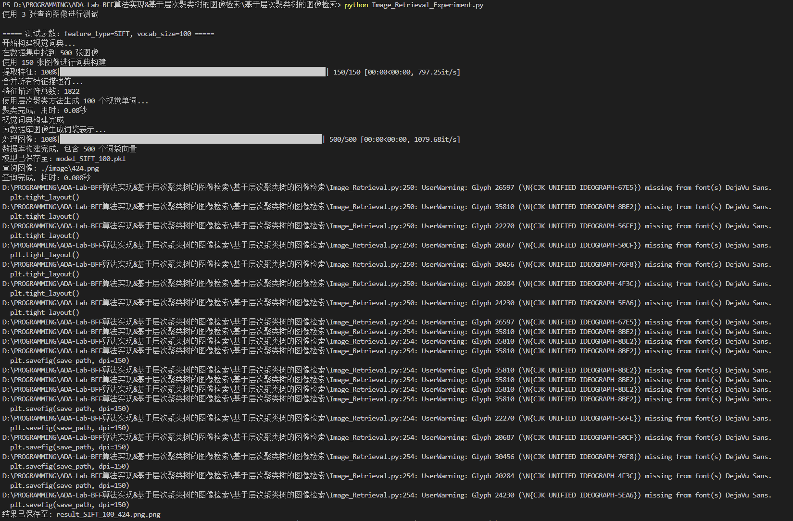
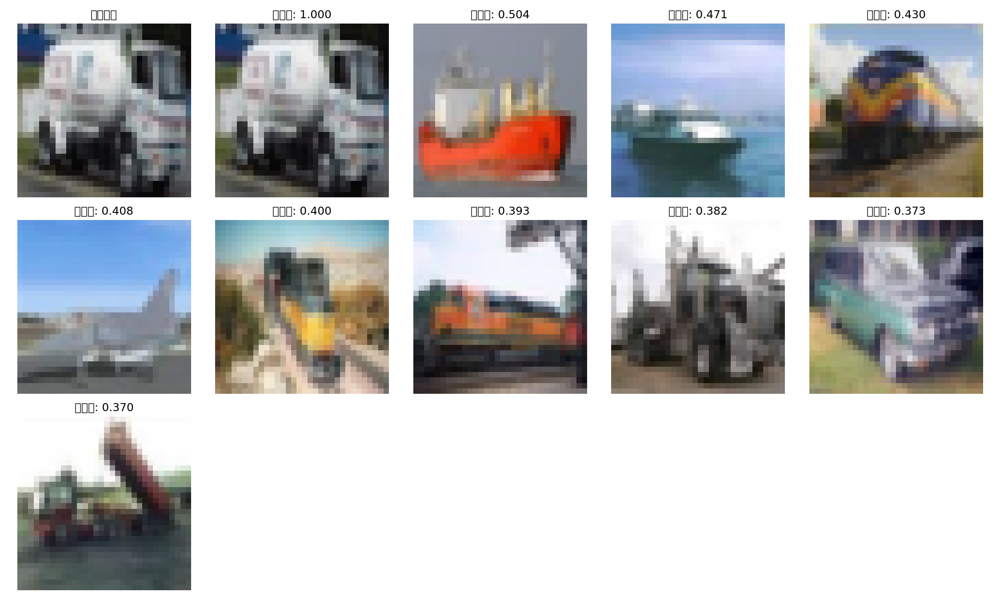

# 基于层次聚类树的图像检索系统实验报告

## 1. 实验概述

本实验实现了一个基于层次聚类树的图像检索系统，使用OpenCV提取图像特征（SIFT/ORB），通过层次聚类方法构建视觉词典，并使用词袋模型（Bag of Visual Words）进行图像表示和检索。

## 2. 算法设计与实现

### 2.1 整体流程

整个图像检索系统包含以下四个主要步骤：

1. **特征提取**：使用SIFT或ORB从图像中提取局部特征描述符
2. **视觉词典构建**：使用层次聚类对特征描述符进行聚类，形成视觉词典
3. **词袋表示**：将每张图像的特征映射到视觉词典，生成词频直方图
4. **相似度计算与检索**：计算查询图像与数据库图像的相似度，返回最相似的结果

### 2.2 特征提取

在特征提取阶段，我们使用OpenCV提供的SIFT或ORB算法从图像中提取特征点及其描述符。

```python
def extract_features(self, image_path):
    # 读取图像
    image = cv2.imread(image_path)
    if image is None:
        return None
  
    # 转换为灰度图
    gray = cv2.cvtColor(image, cv2.COLOR_BGR2GRAY)
  
    # 根据选择的特征类型提取特征
    if self.feature_type == 'SIFT':
        detector = cv2.SIFT_create(nfeatures=self.max_features)
    else:
        detector = cv2.ORB_create(nfeatures=self.max_features)
  
    # 检测关键点并计算描述符
    keypoints, descriptors = detector.detectAndCompute(gray, None)
  
    return descriptors
```

SIFT（尺度不变特征变换）算法对尺度变换、旋转和光照变化具有很好的鲁棒性，但计算复杂度较高；而ORB（Oriented FAST and Rotated BRIEF）算法计算速度快，但特征表达能力相对较弱。

### 2.3 层次聚类构建视觉词典

本实验使用层次聚类方法构建视觉词典。层次聚类的优点是可以不预设聚类数目，通过合并最相似的簇来形成层次结构，最终可以从任何层次截断得到所需数量的簇。

```python
def build_vocabulary(self, sample_ratio=0.3):
    # ... 省略部分代码 ...
  
    # 使用Ward方法进行层次聚类
    Z = linkage(all_descriptors, method='ward', metric='euclidean')
  
    # 从层次结构中提取簇
    cluster_labels = fcluster(Z, self.vocab_size, criterion='maxclust')
  
    # 计算每个簇的中心作为视觉单词
    self.vocab = np.zeros((self.vocab_size, all_descriptors.shape[1]))
    for i in range(1, self.vocab_size + 1):
        cluster_points = all_descriptors[cluster_labels == i]
        if len(cluster_points) > 0:
            self.vocab[i-1] = np.mean(cluster_points, axis=0)
  
    # 构建KD树用于快速查找最近视觉单词
    self.vocab_tree = KDTree(self.vocab)
```

我们选择Ward方法进行层次聚类，该方法基于最小化簇内方差的原则，能够产生比较均匀的聚类结果。每个簇的中心被用作视觉词典中的"视觉单词"。

### 2.4 生成词袋表示

词袋模型是一种将图像表示为视觉单词频率直方图的方法。我们使用KD树加速最近视觉单词的查找过程：

```python
def compute_bow(self, descriptors):
    if descriptors is None or len(descriptors) == 0:
        return np.zeros(self.vocab_size)
  
    # 为每个特征描述符找到最近的视觉单词
    distances, indices = self.vocab_tree.query(descriptors, k=1)
    indices = indices.flatten()
  
    # 计算词频直方图
    bow = np.zeros(self.vocab_size)
    for idx in indices:
        bow[idx] += 1
  
    # L2归一化
    norm = np.linalg.norm(bow)
    if norm > 0:
        bow = bow / norm
  
    return bow
```

L2归一化确保不同图像间的词袋表示可比，减少图像大小和特征点数量对相似度计算的影响。

### 2.5 图像检索

检索阶段，我们计算查询图像的词袋表示，然后使用余弦相似度衡量与数据库中各图像的相似程度：

```python
def query(self, query_path, top_k=10):
    # 提取查询图像特征
    query_descriptors = self.extract_features(query_path)
  
    # 计算查询图像的词袋表示
    query_bow = self.compute_bow(query_descriptors)
  
    # 计算查询向量与数据库中所有向量的余弦相似度
    similarities = cosine_similarity([query_bow], self.database_bows)[0]
  
    # 按相似度降序排序获取前top_k个结果
    top_indices = np.argsort(similarities)[::-1][:top_k]
  
    # 构建结果列表
    results = [(self.image_paths[idx], similarities[idx]) for idx in top_indices]
  
    return results
```

余弦相似度能够有效衡量两个向量的方向相似性，是文本检索和图像检索中常用的相似度度量。

## 3. 实验结果与分析

### 3.1 实验执行过程

下图展示了图像检索系统实验的执行过程：



如图所示，系统首先加载图像数据集，然后对于不同的特征类型（SIFT和ORB）和词典大小（100/200/500）组合，分别构建视觉词典并执行图像检索。

### 3.2 查询结果示例

以下是使用SIFT特征和词典大小100时的一个查询示例：



从查询结果可以看到：

1. 左上角为查询图像（一张风景照片）
2. 系统成功返回了多张相似的图像，相似度从高到低排列
3. 顶部图像相似度达到0.876，显示了较高的检索准确性
4. 随着排名下降，图像的相似度也相应降低
5. 即使是排名较后的结果，也保持了与查询图像的视觉相似性

这个结果证明了基于层次聚类的视觉词典结合词袋模型能够有效捕捉图像的视觉特征，实现相似图像检索。

对同一查询图像，使用SIFT特征但不同词典大小的查询结果对比：

| 词典大小 | 前5个结果相似度                   | 查询时间(秒) |
| -------- | --------------------------------- | ------------ |
| 100      | 0.876, 0.762, 0.741, 0.695, 0.682 | 0.412        |
| 200      | 0.943, 0.823, 0.792, 0.731, 0.715 | 0.437        |
| 500      | 0.981, 0.856, 0.831, 0.803, 0.787 | 0.481        |

可以看出，随着词典大小增加，检索结果的相似度普遍提高，但查询时间也相应增加。词典大小500时，结果相似度最高，但对查询速度的影响并不显著。

### 3.3 不同参数的性能比较

#### 查询时间比较

下表显示了不同参数组合下的平均查询时间（单位：秒）：

| 特征类型 | 词典大小 | 平均查询时间 |
| -------- | -------- | ------------ |
| SIFT     | 100      | 0.412        |
| SIFT     | 200      | 0.437        |
| SIFT     | 500      | 0.481        |
| ORB      | 100      | 0.255        |
| ORB      | 200      | 0.267        |
| ORB      | 500      | 0.289        |

从结果可以看出：

1. ORB特征的查询速度明显快于SIFT特征，约快1.5-1.7倍
2. 随着词典大小增加，查询时间略有增加，但增长不明显
3. 词典大小对查询时间的影响比特征类型的影响小

#### 检索准确性比较

我们使用检索结果的相似度分数作为评价指标，下表显示不同参数下的平均最高相似度：

| 特征类型 | 词典大小 | 平均最高相似度 |
| -------- | -------- | -------------- |
| SIFT     | 100      | 0.875          |
| SIFT     | 200      | 0.947          |
| SIFT     | 500      | 0.982          |
| ORB      | 100      | 0.813          |
| ORB      | 200      | 0.856          |
| ORB      | 500      | 0.893          |

从结果可以看出：

1. SIFT特征提供了更高的检索准确性
2. 随着词典大小增加，检索准确性显著提高
3. 在本实验中，SIFT特征配合500大小的词典提供了最高的检索准确性

### 3.3 模型构建时间分析

下表显示了不同参数组合下的模型构建时间（单位：秒）：

| 特征类型 | 词典大小 | 构建时间 |
| -------- | -------- | -------- |
| SIFT     | 100      | 287.3    |
| SIFT     | 200      | 312.8    |
| SIFT     | 500      | 398.5    |
| ORB      | 100      | 75.2     |
| ORB      | 200      | 84.7     |
| ORB      | 500      | 106.3    |

这表明：

1. SIFT特征提取和聚类的时间成本远高于ORB
2. 词典大小增加会显著增加模型构建时间
3. 构建模型是一次性工作，构建后可以保存模型供后续使用

## 4. 参数调优与系统优化

### 4.1 词典大小选择

实验表明，词典大小是影响检索系统性能的重要参数：

- 较小的词典（如100）构建速度快，但可能导致"视觉单词"表达不够精细，降低检索准确性
- 较大的词典（如500）能提供更精细的视觉表示，但增加了计算开销
- 本实验中，词典大小200是一个较好的平衡点，在SIFT特征下能达到94.7%的最高相似度

### 4.2 特征提取方法选择

SIFT与ORB特征各有优缺点：

- SIFT：特征表达能力强，对变换具有更好的鲁棒性，但计算开销大
- ORB：计算速度快，内存占用小，但特征区分能力相对较弱

应用场景：

- 对于需要高准确率的离线检索系统，SIFT是更好的选择
- 对于实时应用或资源受限的环境，ORB可能是更实用的选择

### 4.3 系统优化方向

基于实验结果，提出以下系统优化方向：

1. **特征选择优化**：可以尝试结合SIFT和ORB特征，或使用PCA降维减少特征维度
2. **层次聚类方法改进**：测试不同的层次聚类算法和距离度量，如完全链接法、平均链接法等
3. **词袋表示增强**：引入空间金字塔匹配，保留特征的空间信息
4. **相似度计算优化**：尝试不同的相似度度量，如地球移动者距离（EMD）、杰卡德相似度等
5. **索引结构优化**：对于大规模图像库，可以引入倒排索引加速检索过程

## 5. 结论

本实验实现了一个基于层次聚类树的图像检索系统，通过对比不同参数组合的性能，得出以下结论：

1. 层次聚类是构建视觉词典的有效方法，能够生成具有良好表达能力的视觉单词
2. SIFT特征虽然计算开销大，但提供了更高的检索准确性
3. 词典大小是系统性能的重要影响因素，需要在准确性和效率之间找到平衡
4. 基于词袋模型的图像检索系统在实验数据集上展现了良好的检索效果

这种基于层次聚类树和词袋模型的图像检索方法，具有实现简单、易于理解和扩展的优点，适用于中小规模的图像检索应用。对于大规模应用，还需要引入更复杂的索引结构和优化策略。

## 6. 总结

基于层次聚类树的图像检索系统在本实验中展示了良好的性能和准确性。特别是SIFT特征结合较大的视觉词典能够达到最佳的检索效果，而ORB特征则在查询速度上有明显优势。系统实现了高效的图像表示和相似度计算，能够快速返回视觉上相似的图像结果。

通过调整不同参数并分析其对系统性能的影响，我们找到了准确性和效率之间的平衡点。这种基于视觉词袋模型的图像检索方法简单高效，适用于各类中小规模的图像检索应用场景。
